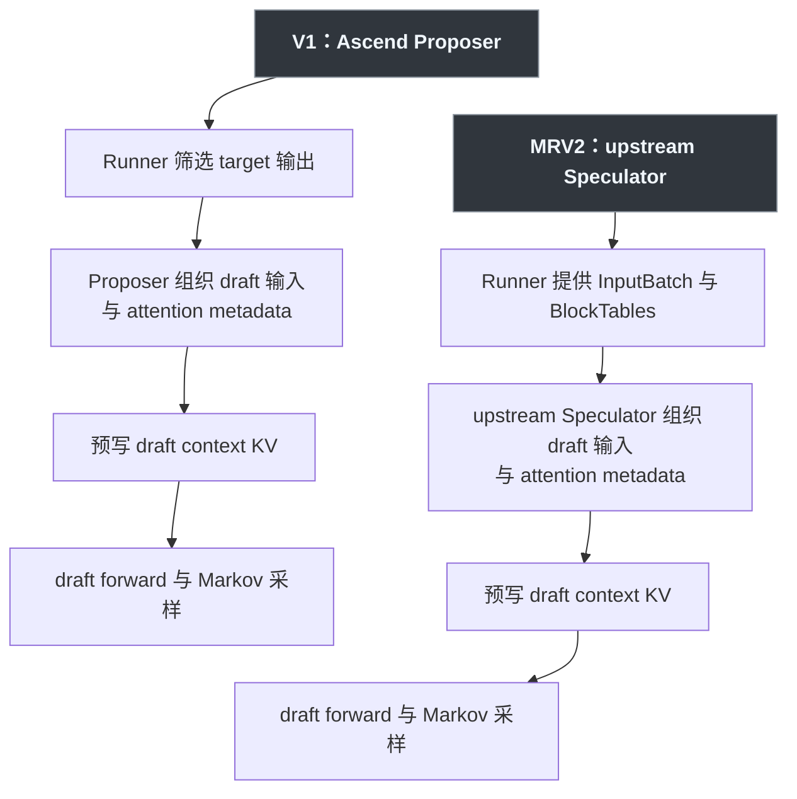

从 V1 迁移到 Model Runner V2（MRV2）后，DSpark 的入口由 `Proposer` 变成了 `Speculator`。类名变化背后，Runner、speculator 与 Ascend adapter 的职责也随之调整。本文结合两套实现回答三个问题：

- 同一次 DSpark decode，两边分别是谁把 target 输出整理成 draft 输入？
- `positions`、block table、slot mapping、attention metadata、target hidden states 和 draft KV 分别归谁？
- 如果两边第一次产生不同的 `draft_token_ids`，应该从哪里开始逐 Tensor 回溯？

分析基于本地源码：

```text
vLLM:        main @ bd6536071c
vLLM Ascend: main @ b4b04c5eb
```

这里的 MRV2 指 vLLM 当前的 GPU Model Runner V2 架构，以及 vLLM Ascend 在它上面提供的 NPU adapter。V1 则专指 `vllm_ascend/worker/model_runner_v1.py` 与 `AscendDSparkProposer` 这条 Ascend 路径。

源码对比可以看到：**V1 的 DSpark orchestration 主要位于 Ascend Proposer；MRV2 将通用 orchestration、状态容器和 draft 算法放到了 upstream vLLM，Ascend Speculator 保留 NPU 相关的适配。** 这次变化重新划分了 Runner、upstream speculator 和硬件 adapter 的职责。

## 一、先对齐两条核心调用链



两条调用链的主要差异，在于 `prepare_dflash_inputs` 及其相关状态由谁组织：

- V1：`NPUModelRunner` 先筛 target tensors，`AscendDSparkProposer` 再自己维护 per-group block/slot buffer、改写 common attention metadata、调用 NPU 输入展开 kernel。
- MRV2：Runner 把统一的 `InputBatch`、`BlockTables`、target attention 结果和 hidden states 交给 speculator；upstream `DSparkSpeculator` 负责 DSpark 输入展开、draft metadata、context KV 与采样算法；Ascend 子类只包住 NPU metadata builder 和图执行差异。

两边的时间关系相同：本轮 target forward 验证上一轮 draft；target sampling 和 bookkeeping 完成后，才为下一轮生成新的 draft。

## 二、V1：Proposer 同时负责输入和状态组织

V1 的入口在 `NPUModelRunner.propose_draft_token_ids()`。Runner 负责先做这些事：

1. 从 rejection sampling 结果得到本轮有效的 `next_token_ids`；
2. 根据 rejected token 过滤 target 的 token、position 和 hidden states；
3. 若 DSpark 需要辅助层，拼接 `aux_hidden_states`；
4. 把 target tensors、common attention metadata 和调度信息传给 `drafter._propose()`。

关键调用位于：

```text
vllm_ascend/worker/model_runner_v1.py
  NPUModelRunner.propose_draft_token_ids()
    → AscendDSparkProposer._propose()
```

V1 Runner 没有 MRV2 中统一的 `BlockTables` speculator scaffold。为了让 DSpark 的多个 draft attention layer 正确访问各自的 KV cache group，`AscendDSparkProposer` 保存了以下状态：

```text
_per_group_block_tables
_per_group_slot_mappings
_per_group_query_slot_mapping_buffers
_per_group_context_slot_mapping_buffers
_context_slot_mapping_buffers
_layer_group_idx
```

block table 仍由 Runner 侧分配。Runner 在构造每个 KV cache group 的 target attention metadata 时，通过 `set_per_group_attn_metadata()` 将各 group 的 block table 和 slot mapping 引用交给 Proposer。Proposer 随后使用自己的 buffer，为 DSpark 重新生成 context/query slot mapping。

`AscendDSparkProposer.set_inputs_first_pass()` 是 V1 的输入编排中心。它对每个 draft KV group 调用 Ascend Triton kernel，一次生成：

```text
draft input_ids
draft positions
context positions
context slot mappings
query slot mappings
token_indices_to_sample
```

随后它还原上轮 rejected suffix，改写 DSpark 本轮所需的：

```text
query_start_loc
seq_lens
num_actual_tokens
max_query_len
slot_mapping
causal
attn_state
```

因此，V1 Proposer 除了调用 draft model，还在 proposal 阶段承担了部分 Runner 和 attention-input builder 的工作。

完成输入准备后，V1 先执行 `precompute_and_store_context_kv()`：把 target hidden states 投影并写入 draft model 自己的 KV cache。然后只做一次 draft backbone forward，再用 Markov Head 从左到右生成 $K$ 个 token。返回值才是 `draft_token_ids`。

## 三、MRV2：通用逻辑进入 upstream Speculator

MRV2 初始化时，上游 `GPUModelRunner` 创建 speculator：

```text
init_speculator()
  → Ascend 注册的 AscendDSparkSpeculator
      → 继承 upstream DSparkSpeculator
          → 继承 upstream DFlashSpeculator
```

模型加载后，Runner 把 target model 交给 speculator 加载 draft model。KV cache 初始化时，Runner 创建一个统一的 `BlockTables`，再通过 `speculator.set_attn(...)` 注入：

```text
model_state
kv_cache_config
BlockTables
target InputBuffers
target attention groups
```

MRV2 speculator 直接复用 Runner 持有的 `BlockTables` scaffold，省去了 V1 中分散的 per-group 字典。DSpark 专用的 context slot buffer 仍由 speculator 创建，block table 的更新、gather 和生命周期则由 Runner 管理。

steady-state proposal 从 upstream `GPUModelRunner.sample_tokens()` 发起。Runner 完成 target sampling 和 `postprocess_sampled()` 后，调用：

```python
draft_tokens = self.speculator.propose(
    input_batch,
    attn_metadata,
    slot_mappings_by_layer,
    spec_hidden_states,
    aux_hidden_states,
    num_sampled,
    num_rejected,
    ...,
)
```

Ascend 的 `AscendDSparkSpeculator.propose()` 处理两项平台相关工作：保存 `input_batch`，并在 `build_attn_metadata_wrapper()` 环境中调用 `super().propose()`。DSpark 主流程由 upstream 实现：

1. 合并 target aux hidden states；
2. 对每个 draft KV group 调用 `prepare_dflash_inputs()`；
3. 由 block table 计算 context/query slot mapping；
4. 调用 `precompute_and_store_context_kv()`；
5. 重建 draft attention metadata；
6. 构造 per-layer slot mappings；
7. `_generate_draft()` 执行 draft backbone；
8. `_sample_sequential()` 用 Markov bias 逐 token 采样；
9. 返回 `draft_tokens[:num_reqs]`。

Ascend adapter 处理 NPU 相关的适配点：

- 将 context slot mapping 转为 NPU 路径需要的 `int32`；
- 收集 Ascend attention backend；
- 用 `build_attn_metadata_wrapper()` 构造 NPU attention metadata；
- 为 Ascend graph manager 配置 speculator 与 update stream；
- 在 proposal 外围建立正确的 Ascend metadata-builder 上下文。

由此可以划分 upstream 与 Ascend adapter 的边界：**upstream 负责 DSpark 的输入算法、context KV 预写、draft attention 组织、draft forward、Markov sampling 和 token 返回；Ascend adapter 负责 NPU attention metadata 的构造上下文、dtype、backend 和图执行适配。**

## 四、状态归属表：创建、维护、消费要分开看

表里的“创建”指分配对象或 buffer，“更新”指每轮填入有效值，“消费”指最终读取并影响计算。某个对象被 Proposer/Speculator 持有引用，不等于它拥有该状态的生命周期。

| 状态 | V1：创建 / 更新 / 消费 | MRV2：创建 / 更新 / 消费 |
|---|---|---|
| `positions` | Runner 创建并填充 target position buffer；`AscendDflashProposer.__init__()` 创建 draft `positions`，`AscendDSparkProposer.set_inputs_first_pass()` 调输入展开 kernel 更新；draft model/attention 消费 | `InputBuffers.__init__()` 创建 target/draft buffer；`prepare_pos_seq_lens()` 更新 target positions，`prepare_dflash_inputs()` 更新 draft positions；RoPE、`BlockTables.compute_slot_mappings()` 和 draft model 消费 |
| block table | Scheduler/KV manager 分配 block IDs，V1 Runner 持有并逐轮更新；`set_per_group_attn_metadata()` 把各 group tensor 引用传给 Proposer；输入展开和 metadata builder 消费 | `BlockTables.__init__()` 创建持久表；`append_block_ids()`、`apply_staged_writes()` 更新，`gather_block_tables()` 收集当前 batch；`compute_slot_mappings()`、`model_state.prepare_attn()` 和 `prepare_dflash_inputs()` 消费 |
| slot mapping | V1 Runner 为 target 构造；`AscendDflashProposer.__init__()` 创建 draft context/query buffers，`set_inputs_first_pass()` 内的 Ascend kernel 每轮重算；cache op、draft attention 与 `precompute_and_store_context_kv()` 消费 | `BlockTables.__init__()` 创建共享 buffer，`DFlashSpeculator.set_attn()` 创建 draft context buffer；`compute_slot_mappings()` 生成 target slots，`prepare_dflash_inputs()` 生成 draft slots；`build_slot_mappings_by_layer()`、KV update 和 Attention 消费。Ascend V2 覆盖 `compute_slot_mappings()`，输出 `int32` |
| attention metadata | V1 Runner 创建 `CommonAttentionMetadata`；Proposer 在 `set_inputs_first_pass()` 中改写 query length、seq lens、slot、causal 等字段；`AscendAttentionMetadataBuilder.build()` 生成 backend metadata并交给 Ascend Attention | `model_state.prepare_attn()` 创建 target metadata，speculator 的 `_build_draft_attn_metadata()` 创建 draft metadata；`set_forward_context()` 保存，`get_attention_context()` 和各 Attention backend 消费 |
| target hidden states | target model forward 创建；V1 `NPUModelRunner.propose_draft_token_ids()` 按有效 token 索引并拼接 aux states，Proposer 合并/拷贝；`precompute_and_store_context_kv()` 消费 | target model forward 创建，Runner 保存于 `ExecuteModelState`；`DSparkSpeculator.propose()` 合并 aux states并复制到 speculator buffer；`precompute_and_store_context_kv()` 消费，Ascend adapter 透传 |
| draft KV | KV cache 初始化阶段按 draft layer/group 分配；`precompute_and_store_context_kv()` 按 context slots 写入，draft model forward 按 query slots 继续写入；`AscendDSparkProposer._propose()` 驱动的 draft Attention 读取 | Runner 的统一 KV cache 初始化为 draft groups 分配；`DFlashSpeculator.set_attn()` 建立 layer/group 对应，`precompute_and_store_context_kv()` 写 context KV，`_generate_draft()` 中的 Attention 写 query KV；`DSparkSpeculator.propose()` 驱动读取 |

### 共享 block table 与共享物理 KV 是两回事

对同一请求、同一逻辑 token，target layer 与 draft layer可以使用同一套请求级 block 编号组织方式；但物理 KV tensor 仍按 layer/cache group 分开分配。slot mapping 解决的是“这个逻辑位置落到哪个物理 slot”，attention layer 再用自己的 KV tensor解释该 slot。

所以：

```text
同一 logical block / slot 编号
        ├─ target layer 的 physical KV tensor
        └─ draft layer 的 physical KV tensor
```

两类 KV 可以使用相同的寻址规则，但 K/V 内容相互独立。DSpark 会对 target hidden states 重新投影，再将结果写入 draft layer cache，不会直接复用 target layer 的 K/V。

## 五、两套实现的职责对照

两套实现的职责可以概括为：

```text
V1   = Runner 筛选 target 输入 + Ascend Proposer 组织 draft 执行状态
MRV2 = Runner 提供统一状态 + upstream Speculator 执行 DSpark + Ascend 适配 NPU
```

更细一点：

| 阶段 | V1 | MRV2 |
|---|---|---|
| 选择本轮请求与 token | Scheduler + V1 Runner | Scheduler + upstream MRV2 Runner |
| target input/attention | Ascend V1 Runner | upstream Runner 骨架 + Ascend Runner/attention override |
| 筛选 target hidden states | V1 Runner | upstream Runner传完整状态，upstream speculator结合 `num_rejected` 整理 |
| draft input_ids/positions | `AscendDSparkProposer` + Ascend Triton kernel | upstream `prepare_dflash_inputs()` |
| draft block/slot bookkeeping | Runner提供group table，Proposer自持per-group映射与buffer | Runner拥有统一 `BlockTables`，upstream speculator复用并填 draft slots |
| draft attention metadata | Ascend Proposer改写 common metadata并构造 | upstream speculator决定shape/语义，Ascend wrapper调用NPU builder |
| context KV precompute | Ascend Proposer驱动 draft model | upstream speculator驱动 draft model |
| draft forward与Markov采样 | Ascend proposer/model实现 | upstream `DSparkSpeculator` 实现；Ascend只适配执行环境 |

## 六、架构变化与待验证边界

### 从接口变化看状态边界调整

`AscendDSparkProposer` 到 `AscendDSparkSpeculator` 的变化同时调整了状态边界。V1 Proposer 内部维护了一套近似 mini-runner 的 per-group block/slot/metadata bookkeeping；MRV2 将这些通用能力放入 upstream Runner、`BlockTables` 和 upstream DFlash/DSpark Speculator，Ascend 子类保留平台适配。对应到执行流程上，DSpark orchestration 已经移至 upstream。

### 尚待运行时验证的边界

Python 控制流能够说明“logical block → slot”的计算方式和 ownership。要确认真实 token 在各层中的具体地址映射，还需要在运行时逐层记录以下数值：

```text
logical token position
  → block_table[req, logical_block]
  → physical_block_id
  → slot = physical_block_id × block_size + offset
  → 某个 target/draft layer 的 physical KV tensor 地址
```

还需要覆盖混合 KV cache group、不同 kernel block size、DSpark 多 draft group 等配置，确认 target metadata 与 draft metadata 共享哪些布局约束，以及两者在同一 `BlockTables` 中分别构造的部分。名称相同的 slot mapping，底层布局未必相同。

## 七、三个核心问题的答案

### ① 两条到 `draft_token_ids` 的调用链分别是什么？

```text
V1:
NPUModelRunner.sample_tokens
→ propose_draft_token_ids
→ AscendDSparkProposer._propose
→ set_inputs_first_pass
→ precompute_and_store_context_kv
→ draft model forward
→ Markov sequential sampling
→ draft_token_ids

MRV2:
upstream GPUModelRunner.sample_tokens
→ AscendDSparkSpeculator.propose
→ upstream DSparkSpeculator.propose
→ prepare_dflash_inputs
→ precompute_and_store_context_kv
→ _build_draft_attn_metadata
→ _generate_draft
→ _sample_sequential
→ draft_tokens
```

### ② MRV2 中 upstream 与 Ascend adapter 的边界是什么？

upstream 负责 DSpark 的算法和通用执行生命周期：状态 buffer、输入展开、block/slot 使用、context KV、draft metadata 语义、draft forward、Markov sampling、greedy/probabilistic sampling。

Ascend adapter 负责 NPU 落地：Ascend attention metadata builder 上下文、slot dtype、Ascend backend 收集、graph manager 接线与 stream 更新。Runner 自身也有 Ascend override，但那属于 target/MRV2 平台执行适配，不等于 DSpark 算法被重新实现了一遍。

### ③ 两边第一次出现不同 token，按什么顺序向前比？

先固定请求、draft step、采样模式和 seed，再从输出向前逐层比较：

```text
draft_token_ids
  ← 每步加入 Markov bias 后的 draft logits
  ← backbone base logits / head hidden states
  ← DSpark query input_ids + positions + sample_indices
  ← target hidden states（含 aux combine 后结果）
  ← draft attention metadata
       query_start_loc / seq_lens / causal / block table / slot mapping
  ← draft context KV 与 query KV 的实际写入内容
```

实操时建议把“draft logits”拆成三层比较：

1. backbone `base_logits[:, step]`；
2. `markov_bias(previous_token)`；
3. 两者相加后的最终 logits，以及 argmax/Gumbel sampler 输入。

如果最终 logits 已经不同，可以继续向前比较 head hidden，无需先排查 rejection sampler。head hidden 首次出现差异时，再比较 DSpark inputs；inputs 相同而 hidden 不同时，重点检查 target hidden states、attention metadata 与 draft KV。按照这个顺序，可以逐步区分采样、模型输入和寻址带来的差异。

## 八、后续验证方案

验证时可以选定一个请求中的一个 token，分别记录它在 V1 与 MRV2 中的逻辑 position、logical block index、block table entry、slot mapping 和最终 physical KV tensor offset；同时记录 target layer 与 DSpark draft layer 使用的 KV cache group、metadata 对象和 kernel block size。

这项验证需要回答：

> 一个 token 在 V1 / MRV2 中究竟如何通过 `block table → slot mapping → physical KV` 找到自己的 KV Cache？DSpark draft KV 与 target KV 的 metadata 是同一种组织规则、不同实例，还是在某些 KV group/backend 下连布局规则也不同？

当前源码表明，两者在同一个 Runner/KV cache 配置框架下分别构造。具体布局是否完全一致，还需要通过逐 Tensor、逐地址的运行时数据验证。

## 源码索引

V1 主线：

```text
vllm_ascend/worker/model_runner_v1.py
vllm_ascend/spec_decode/dspark_proposer.py
vllm_ascend/spec_decode/dflash_proposer.py
vllm_ascend/spec_decode/llm_base_proposer.py
vllm_ascend/ops/triton/spec_decode/utils.py
```

MRV2 主线：

```text
vllm/v1/worker/gpu/model_runner.py
vllm/v1/worker/gpu/block_table.py
vllm/v1/worker/gpu/spec_decode/speculator.py
vllm/v1/worker/gpu/spec_decode/dflash/speculator.py
vllm/v1/worker/gpu/spec_decode/dspark/speculator.py
vllm_ascend/worker/v2/model_runner.py
vllm_ascend/worker/v2/spec_decode/dspark/speculator.py
vllm_ascend/worker/v2/attn_utils.py
```
