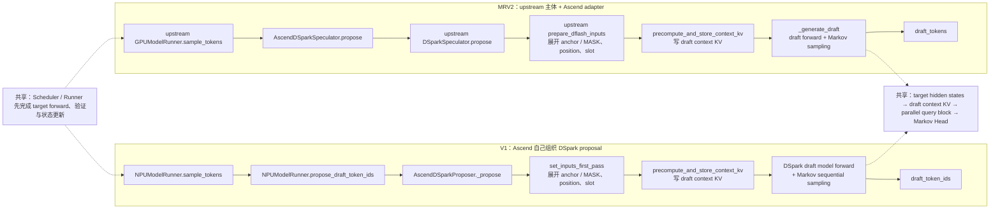

本文讨论的并不只是“V1 叫 Proposer，MRV2 叫 Speculator”这一命名差异，而是三个更具体的问题：

- 同一次 DSpark decode，两边分别是谁把 target 输出整理成 draft 输入？
- `positions`、block table、slot mapping、attention metadata、target hidden states 和 draft KV 分别归谁？
- 如果两边第一次产生不同的 `draft_token_ids`，应该从哪里开始逐 Tensor 回溯？

分析基于本地源码：

```text
vLLM:        main @ bd6536071c
vLLM Ascend: main @ b4b04c5eb
```

这里的 MRV2 指 vLLM 当前的 GPU Model Runner V2 架构，以及 vLLM Ascend 在它上面提供的 NPU adapter。V1 则专指 `vllm_ascend/worker/model_runner_v1.py` 与 `AscendDSparkProposer` 这条 Ascend 路径。

先给结论：**V1 把 DSpark orchestration 大量放在 Ascend Proposer 内；MRV2 把通用 DSpark orchestration、状态容器和 draft 算法上移到了 upstream vLLM，Ascend Speculator 只保留 NPU 必需的适配。** 因此 MRV2 不是把 `Proposer` 重命名为 `Speculator`，而是重新划分了 Runner、upstream speculator 和硬件 adapter 的职责。

## 一、先对齐两条核心调用链



这张图里最重要的分叉不是类名，而是 `prepare_dflash_inputs` 及其周边状态由谁组织：

- V1：`NPUModelRunner` 先筛 target tensors，`AscendDSparkProposer` 再自己维护 per-group block/slot buffer、改写 common attention metadata、调用 NPU 输入展开 kernel。
- MRV2：Runner 把统一的 `InputBatch`、`BlockTables`、target attention 结果和 hidden states 交给 speculator；upstream `DSparkSpeculator` 负责 DSpark 输入展开、draft metadata、context KV 与采样算法；Ascend 子类只包住 NPU metadata builder 和图执行差异。

两边的时间关系相同：本轮 target forward 验证上一轮 draft；target sampling 和 bookkeeping 完成后，才为下一轮生成新的 draft。

## 二、V1：Proposer 是一座“自带脚手架的小 Runner”

V1 的入口在 `NPUModelRunner.propose_draft_token_ids()`。Runner 负责先做这些事：

1. 从 rejection sampling 结果得到本轮有效的 `next_token_ids`；
2. 根据 rejected token 过滤 target 的 token、position 和 hidden states；
3. 若 DSpark 需要辅助层，拼接 `aux_hidden_states`；
4. 把 target tensors、common attention metadata 和调度信息传给 `drafter._propose()`。

关键调用位于：

```text
vllm_ascend/worker/model_runner_v1.py
  NPUModelRunner.propose_draft_token_ids()
    → AscendDSparkProposer._propose()
```

但 V1 Runner 没有 MRV2 的统一 `BlockTables` speculator scaffold。为了让 DSpark 的多个 draft attention layer 正确落到各自 KV cache group，`AscendDSparkProposer` 自己保存了：

```text
_per_group_block_tables
_per_group_slot_mappings
_per_group_query_slot_mapping_buffers
_per_group_context_slot_mapping_buffers
_context_slot_mapping_buffers
_layer_group_idx
```

这些 block table 并不是 Proposer 分配的。Runner 在构造每个 KV cache group 的 target attention metadata 时，通过 `set_per_group_attn_metadata()` 把各 group 的 block table 和 slot mapping 引用交给 Proposer。Proposer 随后用自己的 buffer 为 DSpark 重新生成 context/query slot mapping。

`AscendDSparkProposer.set_inputs_first_pass()` 是 V1 的输入编排中心。它对每个 draft KV group 调用 Ascend Triton kernel，一次生成：

```text
draft input_ids
draft positions
context positions
context slot mappings
query slot mappings
token_indices_to_sample
```

随后它还原上轮 rejected suffix，改写 DSpark 本轮所需的：

```text
query_start_loc
seq_lens
num_actual_tokens
max_query_len
slot_mapping
causal
attn_state
```

也就是说，V1 Proposer 不只是“调用 draft model”。它在 proposal 阶段临时承担了一部分 Runner/attention-input builder 的职责。

完成输入准备后，V1 先执行 `precompute_and_store_context_kv()`：把 target hidden states 投影并写入 draft model 自己的 KV cache。然后只做一次 draft backbone forward，再用 Markov Head 从左到右生成 $K$ 个 token。返回值才是 `draft_token_ids`。

## 三、MRV2：Speculator 接口背后是一次职责重分配

MRV2 初始化时，上游 `GPUModelRunner` 创建 speculator：

```text
init_speculator()
  → Ascend 注册的 AscendDSparkSpeculator
      → 继承 upstream DSparkSpeculator
          → 继承 upstream DFlashSpeculator
```

模型加载后，Runner 把 target model 交给 speculator 加载 draft model。KV cache 初始化时，Runner 创建一个统一的 `BlockTables`，再通过 `speculator.set_attn(...)` 注入：

```text
model_state
kv_cache_config
BlockTables
target InputBuffers
target attention groups
```

这一步是架构差异的核心。MRV2 speculator 不再像 V1 那样收集十来个散落的 per-group 字典，而是直接复用 Runner 拥有的 `BlockTables` scaffold。它仍会创建 DSpark 专用的 context slot buffer，但 block table 的更新、gather 和生命周期属于 Runner。

steady-state proposal 从 upstream `GPUModelRunner.sample_tokens()` 发起。Runner 完成 target sampling 和 `postprocess_sampled()` 后，调用：

```python
draft_tokens = self.speculator.propose(
    input_batch,
    attn_metadata,
    slot_mappings_by_layer,
    spec_hidden_states,
    aux_hidden_states,
    num_sampled,
    num_rejected,
    ...,
)
```

Ascend 的 `AscendDSparkSpeculator.propose()` 只做两件与平台有关的事：记住 `input_batch`，并在 `build_attn_metadata_wrapper()` 环境中调用 `super().propose()`。真正的 DSpark 主流程仍在 upstream：

1. 合并 target aux hidden states；
2. 对每个 draft KV group 调用 `prepare_dflash_inputs()`；
3. 由 block table 计算 context/query slot mapping；
4. 调用 `precompute_and_store_context_kv()`；
5. 重建 draft attention metadata；
6. 构造 per-layer slot mappings；
7. `_generate_draft()` 执行 draft backbone；
8. `_sample_sequential()` 用 Markov bias 逐 token 采样；
9. 返回 `draft_tokens[:num_reqs]`。

Ascend adapter 覆盖的是 NPU 必需的接缝：

- 将 context slot mapping 转为 NPU 路径需要的 `int32`；
- 收集 Ascend attention backend；
- 用 `build_attn_metadata_wrapper()` 构造 NPU attention metadata；
- 给 Ascend graph manager 补回 speculator 与 update stream；
- 在 proposal 外围建立正确的 Ascend metadata-builder 上下文。

因此，upstream 与 Ascend adapter 的边界可以概括为：**DSpark 的输入算法、context KV 预写、draft attention 组织、draft forward、Markov sampling 和返回 token 的主流程来自 upstream；NPU attention metadata 的具体构造上下文、dtype、backend 与图执行接缝属于 Ascend adapter。**

## 四、状态归属表：创建、维护、消费要分开看

表里的“创建”指分配对象或 buffer，“更新”指每轮填入有效值，“消费”指最终读取并影响计算。某个对象被 Proposer/Speculator 持有引用，不等于它拥有该状态的生命周期。

| 状态 | V1：创建 / 更新 / 消费 | MRV2：创建 / 更新 / 消费 |
|---|---|---|
| `positions` | Runner 创建 target position buffer并更新 target positions；`AscendDSparkProposer` 另建 draft `positions` buffer，输入展开 kernel 每轮更新；draft model/attention 消费 | Runner 的 `InputBuffers` 创建 target positions；upstream speculator 自带 draft `InputBuffers`，`prepare_dflash_inputs()` 更新 draft positions；draft model 消费。Ascend 不重新定义其算法 |
| block table | Scheduler/KV manager 分配 block IDs，V1 Runner 持有并逐轮更新；Runner 把各 group tensor 引用传给 Proposer；输入展开和 attention builder 消费 | upstream Runner 创建并拥有统一 `BlockTables`，根据 SchedulerOutput 追加/更新 block IDs；通过 `set_attn()` 注入 speculator；target 与 draft 输入准备共同读取相应 group |
| slot mapping | V1 Runner 为 target 构造；Proposer 自建 per-group context/query buffers，Ascend kernel 根据 block table 每轮重算；target/draft attention 与 context-KV precompute 分别消费 | `BlockTables` 创建共享 slot-mapping buffers；target `prepare_attn()` 与 upstream `prepare_dflash_inputs()` 分别写入本轮 target/draft 区域；`build_slot_mappings_by_layer()` 和各 attention layer 消费。Ascend 把 draft context slots 转为 `int32` |
| attention metadata | V1 Runner/Ascend builder 创建 target common/group metadata；Proposer复制并改写 DSpark query 长度、seq len、slot、causal 等字段，再由 Ascend backend 消费 | upstream Runner 创建 target metadata；upstream speculator根据 draft query shape 调 `_build_draft_attn_metadata()`；Ascend wrapper选择 NPU builder，NPU attention backend消费 |
| target hidden states | target model 创建，V1 Runner 按有效 token 索引并拼接 aux states；Proposer合并/拷贝，draft model 的 context-KV precompute 消费 | target model 创建，upstream Runner保存于 `ExecuteModelState` 并传给 speculator；upstream speculator合并 aux states、拷入自身 buffer，context-KV precompute 消费；Ascend adapter透传 |
| draft KV | V1 Runner 在全局 KV cache 初始化阶段分配 draft layer 的物理 cache；Proposer根据 target hidden states 与 context slot mapping 写入，draft attention继续写/读 query KV | upstream Runner统一初始化所有 target/draft layer 的物理 KV cache；upstream speculator选择 draft groups和slots并预写context KV；draft attention读写draft layer cache。Ascend backend执行具体 NPU cache op |

### 一个必须避免的误解：共享 block table 不等于共享物理 KV

对同一请求、同一逻辑 token，target layer 与 draft layer可以使用同一套请求级 block 编号组织方式；但物理 KV tensor 仍按 layer/cache group 分开分配。slot mapping 解决的是“这个逻辑位置落到哪个物理 slot”，attention layer 再用自己的 KV tensor解释该 slot。

所以：

```text
同一 logical block / slot 编号
        ├─ target layer 的 physical KV tensor
        └─ draft layer 的 physical KV tensor
```

它们可以共享寻址规则，却不是共享 K/V 内容。DSpark 的 context KV 正是由 target hidden states重新投影后写进 draft layer cache，而不是直接拿 target layer 的 K/V 来用。

## 五、同一次 DSpark decode，两边到底是谁组织什么？

把职责压缩成一句话：

```text
V1   = Runner 筛 target 输入 + Ascend Proposer 自己搭 draft 执行脚手架
MRV2 = Runner 提供统一状态骨架 + upstream Speculator 完成 DSpark + Ascend 适配 NPU 接缝
```

更细一点：

| 阶段 | V1 | MRV2 |
|---|---|---|
| 选择本轮请求与 token | Scheduler + V1 Runner | Scheduler + upstream MRV2 Runner |
| target input/attention | Ascend V1 Runner | upstream Runner 骨架 + Ascend Runner/attention override |
| 筛选 target hidden states | V1 Runner | upstream Runner传完整状态，upstream speculator结合 `num_rejected` 整理 |
| draft input_ids/positions | `AscendDSparkProposer` + Ascend Triton kernel | upstream `prepare_dflash_inputs()` |
| draft block/slot bookkeeping | Runner提供group table，Proposer自持per-group映射与buffer | Runner拥有统一 `BlockTables`，upstream speculator复用并填 draft slots |
| draft attention metadata | Ascend Proposer改写 common metadata并构造 | upstream speculator决定shape/语义，Ascend wrapper调用NPU builder |
| context KV precompute | Ascend Proposer驱动 draft model | upstream speculator驱动 draft model |
| draft forward与Markov采样 | Ascend proposer/model实现 | upstream `DSparkSpeculator` 实现；Ascend只适配执行环境 |

## 六、需要澄清的架构误解与待验证边界

### 不只是接口改名

一种容易产生的误解是：MRV2 只是把 V1 的 `AscendDSparkProposer` 换成 `AscendDSparkSpeculator`，其余变化仅是接口改名。源码中的状态归属与调用关系并不支持这一判断。

真正变化的是状态边界：V1 Proposer 内部有一套近似 mini-runner 的 per-group block/slot/metadata bookkeeping；MRV2 把这套通用基础设施放进 upstream Runner、`BlockTables` 和 upstream DFlash/DSpark Speculator，Ascend 子类只留下平台接缝。类名变化只是表面，**orchestration 上移 upstream 才是本质**。

### 尚待运行时验证的边界

从 Python 控制流可以确认“logical block → slot”的计算方式和 ownership，但仅靠静态分析还不足以确认一个真实 token 在各层中的具体地址映射。完整验证需要逐层记录以下数值：

```text
logical token position
  → block_table[req, logical_block]
  → physical_block_id
  → slot = physical_block_id × block_size + offset
  → 某个 target/draft layer 的 physical KV tensor 地址
```

尤其需要继续确认：混合 KV cache group、不同 kernel block size、DSpark 多 draft group 时，target metadata 与 draft metadata到底共享哪些布局约束，哪些只是在相同 `BlockTables` 外壳下分别构造。这不是仅靠“两个对象都叫 slot mapping”就能下结论的。

## 七、三个核心问题的答案

### ① 两条到 `draft_token_ids` 的调用链分别是什么？

```text
V1:
NPUModelRunner.sample_tokens
→ propose_draft_token_ids
→ AscendDSparkProposer._propose
→ set_inputs_first_pass
→ precompute_and_store_context_kv
→ draft model forward
→ Markov sequential sampling
→ draft_token_ids

MRV2:
upstream GPUModelRunner.sample_tokens
→ AscendDSparkSpeculator.propose
→ upstream DSparkSpeculator.propose
→ prepare_dflash_inputs
→ precompute_and_store_context_kv
→ _build_draft_attn_metadata
→ _generate_draft
→ _sample_sequential
→ draft_tokens
```

### ② MRV2 中 upstream 与 Ascend adapter 的边界是什么？

upstream 负责 DSpark 的算法和通用执行生命周期：状态 buffer、输入展开、block/slot 使用、context KV、draft metadata 语义、draft forward、Markov sampling、greedy/probabilistic sampling。

Ascend adapter 负责 NPU 落地：Ascend attention metadata builder 上下文、slot dtype、Ascend backend 收集、graph manager 接线与 stream 更新。Runner 自身也有 Ascend override，但那属于 target/MRV2 平台执行适配，不等于 DSpark 算法被重新实现了一遍。

### ③ 两边第一次出现不同 token，按什么顺序向前比？

先固定同一个请求、同一个 draft step、同一个采样模式和 seed，然后按离输出从近到远的顺序：

```text
draft_token_ids
  ← 每步加入 Markov bias 后的 draft logits
  ← backbone base logits / head hidden states
  ← DSpark query input_ids + positions + sample_indices
  ← target hidden states（含 aux combine 后结果）
  ← draft attention metadata
       query_start_loc / seq_lens / causal / block table / slot mapping
  ← draft context KV 与 query KV 的实际写入内容
```

实操时建议把“draft logits”拆成三层比较：

1. backbone `base_logits[:, step]`；
2. `markov_bias(previous_token)`；
3. 两者相加后的最终 logits，以及 argmax/Gumbel sampler 输入。

若最终 logits 已不同，就不要先怀疑 rejection sampler；继续向前比较 head hidden。若 head hidden 第一次不同，再比较 DSpark inputs。若 inputs相同而 hidden 不同，优先检查 target hidden states、attention metadata与draft KV。这个顺序能把采样差异、模型输入差异和寻址差异分开。

## 八、后续验证方案

验证时可以选定一个请求中的一个 token，分别记录它在 V1 与 MRV2 中的逻辑 position、logical block index、block table entry、slot mapping 和最终 physical KV tensor offset；同时记录 target layer 与 DSpark draft layer 使用的 KV cache group、metadata 对象和 kernel block size。

这项验证需要回答：

> 一个 token 在 V1 / MRV2 中究竟如何通过 `block table → slot mapping → physical KV` 找到自己的 KV Cache？DSpark draft KV 与 target KV 的 metadata 是同一种组织规则、不同实例，还是在某些 KV group/backend 下连布局规则也不同？

基于当前源码可以确认的是：两者在同一个 Runner/KV cache 配置框架下分别构造。至于具体布局是否完全一致，还需要逐 Tensor、逐地址的运行时证据，不能仅凭静态结构下结论。

## 源码索引

V1 主线：

```text
vllm_ascend/worker/model_runner_v1.py
vllm_ascend/spec_decode/dspark_proposer.py
vllm_ascend/spec_decode/dflash_proposer.py
vllm_ascend/spec_decode/llm_base_proposer.py
vllm_ascend/ops/triton/spec_decode/utils.py
```

MRV2 主线：

```text
vllm/v1/worker/gpu/model_runner.py
vllm/v1/worker/gpu/block_table.py
vllm/v1/worker/gpu/spec_decode/speculator.py
vllm/v1/worker/gpu/spec_decode/dflash/speculator.py
vllm/v1/worker/gpu/spec_decode/dspark/speculator.py
vllm_ascend/worker/v2/model_runner.py
vllm_ascend/worker/v2/spec_decode/dspark/speculator.py
vllm_ascend/worker/v2/attn_utils.py
```
