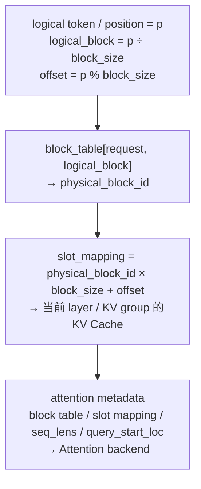
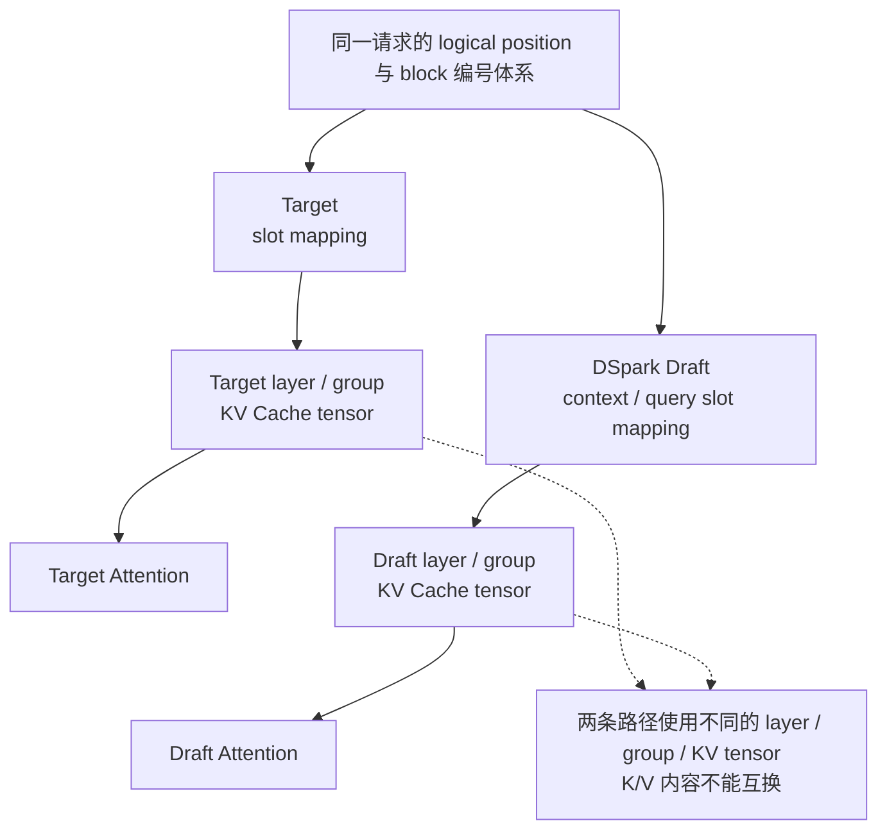

大模型进入 decode 阶段后，每个请求通常只新增少量 token。Attention 却仍要读取此前所有 token 的 K/V。如果把每条请求的 KV 存成一段连续内存，请求长度变化、请求结束和并发调度都会带来内存搬移与碎片。Paged Attention 的处理方式是把 KV Cache 切成固定大小的物理 block，再用映射关系把逻辑序列接到这些 block 上。

实现这套映射需要三个对象：

- `block table` 保存请求使用的物理 block 编号；
- `slot mapping` 给出本轮每个 token 的具体写入位置；
- `attention metadata` 把序列长度、block table、slot mapping 和 backend 所需参数组织起来，供 Attention 执行。

本文沿一个 token 的路径说明三者如何配合，并对照 vLLM Ascend V1 与 Model Runner V2（MRV2）中的函数归属。分析基于以下源码版本：

```text
vLLM:        main @ bd6536071c
vLLM Ascend: main @ b4b04c5eb
```

## 一、Token 到 Attention 的寻址链路



图中的数据分为两类：

- `position`、logical block 和 offset 描述 token 在请求序列中的逻辑位置；
- physical block、slot 和 KV tensor 描述它在设备内存中的位置。

block table 完成“请求逻辑 block → 物理 block”的映射，slot mapping 再把本轮 token 展开到具体 slot。Attention metadata 汇总本轮计算所需的寻址信息和序列信息，交给 backend 执行。

## 二、三个对象的职责

### position 是序列坐标

`input_id` 表示 token 是什么，`position` 表示 token 位于序列中的哪里。RoPE 使用 position，KV 寻址也使用 position，但 token ID 本身不决定 KV 写入地址。

假设请求已经计算了 37 个 token，本轮 decode 新增一个 token：

```text
num_computed_tokens = 37
positions = [37]
```

Runner 根据已计算长度和本轮调度长度生成 positions。MRV2 路径中，这项工作位于 `prepare_pos_seq_lens()`；positions 随后进入模型位置编码，也会传给 `BlockTables.compute_slot_mappings()`。

### block table 是请求级页表

block table 的一行属于一个请求。第 `i` 项表示该请求第 `i` 个 logical block 当前映射到哪个 physical block。

```text
request A block table = [12, 7, 20]

logical block 0 → physical block 12
logical block 1 → physical block 7
logical block 2 → physical block 20
```

物理 block 不必连续。Scheduler/KV manager 可以从空闲池中分配 block，Runner 只需要保存映射。请求扩展时追加 block，请求结束后物理 block 可以被回收并分配给其他请求。

### slot mapping 是 token 级地址

slot mapping 面向本轮参与计算的 token。给定 position、block size 和 block table，可以算出 token 在扁平 KV 地址空间中的 slot：

```text
logical_block = position // block_size
offset        = position % block_size
physical_block_id = block_table[logical_block]
slot          = physical_block_id * block_size + offset
```

vLLM MRV2 的 `_compute_slot_mappings_kernel()` 执行的就是这组计算；Ascend 的 `AscendBlockTables.compute_slot_mappings()` 保留同样的映射关系，并将输出调整为 NPU cache op 需要的 `int32`。

## 三、地址计算示例

假设：

```text
block_size = 16
position = 37
block_table = [12, 7, 20]
```

position 37 对应的逻辑 block 和 block 内偏移为：

```text
logical_block = 37 // 16 = 2
offset        = 37 % 16  = 5
```

查询 block table 得到 physical block：

```text
physical_block_id = block_table[2] = 20
```

最终 slot 为：

```text
slot = 20 * 16 + 5 = 325
```

position 37 的 K/V 应写入当前 KV tensor 的 slot 325。slot 325 只给出 block 内存布局中的索引；当前 Attention layer 和 KV cache group 决定它对应哪个 tensor。

如果只保留 block table，backend 还要为本轮每个 token重复执行除法、取余和查表；如果只保留 slot mapping，Runner 又失去了请求级的持久映射，无法方便地追加、回收和重新 gather 请求。两层结构分别服务请求生命周期和单轮设备执行。

## 四、Attention metadata 与 KV Cache 的连接方式

slot mapping 给出新 K/V 的写入位置，block table 和 sequence length 则限定 Attention 可读取的历史 K/V。backend 执行时需要同时使用这些信息。

MRV2 准备 attention 时，会组合以下状态：

```text
query_start_loc
seq_lens
block_tables
slot_mappings
prefill / decode 状态
KV cache group
attention backend
graph mode
```

`model_state.prepare_attn()` 根据当前模型和 backend 构造 metadata，`build_slot_mappings_by_layer()` 再按 layer 与 KV cache group 整理 slot mapping。Runner 进入 `set_forward_context(...)` 后，Attention layer 从 forward context 取得三项数据：

```text
当前 layer 的 attention metadata
当前 layer 的 KV cache tensor
当前 layer 的 slot mapping
```

以 upstream vLLM 为例，`get_attention_context()` 负责从 forward context 中取出这些对象；KV 更新路径再由 `unified_kv_cache_update()` 或具体 backend 的 cache op 消费 slot mapping。Attention 读取历史 K/V 时，则根据 metadata 中的 block table、sequence length 和 backend 参数访问正确范围。

一次 forward 包含两个相关动作：

1. 使用 slot mapping 把本轮生成的 K/V 写入物理 cache；
2. 使用 block table 和序列信息找到该请求可见的历史 K/V，执行 Attention。

这两个动作共用同一套请求状态。任意一处 position、block table、slot mapping 或 seq lens 出现偏差，都可能让新 K/V 写错位置，或让 Attention 读到错误历史。

## 五、Target KV 与 DSpark Draft KV 的隔离



target 和 draft 可以采用相同的 logical block 编号规则，甚至由同一个 `BlockTables` 对象管理不同 KV cache group。它们的物理 KV tensor 仍然按 layer/group 分开。

K/V 是模型层计算的结果。Target Attention 与 DSpark draft layer 使用不同的投影权重、head 布局和 cache spec。DSpark 的 context KV 由 target hidden states 经过 draft layer 的投影生成，再通过 draft context slot mapping 写入 draft KV Cache。这段计算由 `precompute_and_store_context_kv()` 完成。

对应到状态管理上：

- target 与 draft 共享请求级 block 寻址框架；
- target KV 与 draft KV 的内容和消费方完全分开。

相同的 block ID 或 slot 数值只说明寻址编号一致。判断 K/V 归属时，还要核对 KV cache group、layer name、实际 tensor 和 metadata 对象。

## 六、V1 与 MRV2：创建、更新、消费到具体函数

下表沿用上一篇 V1/MRV2 对照的范围。函数名按本文开头列出的源码版本整理；模型和 attention backend 不同时，最后的 cache op 会变化，因此表中保留通用入口与 Ascend 入口。

| 状态 | V1：创建 → 更新 → 消费 | MRV2：创建 → 更新 → 消费 |
|---|---|---|
| `positions` | `NPUModelRunner` 初始化 target position buffer → Runner 输入准备填 target positions；`AscendDflashProposer.__init__()` 创建 draft `positions`，`AscendDSparkProposer.set_inputs_first_pass()` 调输入展开 kernel 更新 → RoPE、draft model 与 attention 消费 | `InputBuffers.__init__()` 创建 buffer → `prepare_pos_seq_lens()` 根据 `num_computed_tokens`、`query_start_loc` 填值；`prepare_dflash_inputs()` 另填 draft query/context positions → model/RoPE、`BlockTables.compute_slot_mappings()`、draft model 消费 |
| block table | V1 Runner/KV cache 初始化创建 group table → Runner 根据 SchedulerOutput 更新；`set_per_group_attn_metadata()` 将各 group 引用交给 Proposer → target metadata builder、`AscendDSparkProposer.set_inputs_first_pass()` 消费 | `BlockTables.__init__()` 创建持久表 → `append_block_ids()` 暂存增量，`apply_staged_writes()` 写入，`gather_block_tables()` 收集当前 batch → `compute_slot_mappings()`、`model_state.prepare_attn()`、`prepare_dflash_inputs()` 消费 |
| slot mapping | V1 Runner 创建 target slot buffer；`AscendDflashProposer.__init__()` 创建 draft context/query buffer → Runner 更新 target slots，`set_inputs_first_pass()` 内的 Ascend kernel 根据 position 与 block table 更新 draft slots → target/draft cache op 与 Attention backend 消费 | `BlockTables.__init__()` 创建共享 slot buffer；`DFlashSpeculator.set_attn()` 创建 draft context slot buffer → `BlockTables.compute_slot_mappings()` 生成 target slots，`prepare_dflash_inputs()` 生成 draft context/query slots，`build_slot_mappings_by_layer()` 按 layer 整理 → `set_forward_context()` 注入，`get_attention_context()`、KV update 与 Attention 消费 |
| attention metadata | V1 Runner 创建 `CommonAttentionMetadata`，各 `AscendAttentionMetadataBuilder` 绑定 group → Runner 填 target 字段；Proposer 在 `set_inputs_first_pass()` 中改写 query length、seq lens、slot、causal 等 draft 字段 → `AscendAttentionMetadataBuilder.build()` 生成 backend metadata，Ascend Attention backend 消费 | `model_state.prepare_attn()` 调通用/平台 builder 创建 target metadata；DFlash/DSpark speculator 的 `_build_draft_attn_metadata()` 创建 draft metadata → `set_forward_context()` 保存当前 forward 状态 → `get_attention_context()` 与各 Attention backend 消费 |
| target KV | KV cache 初始化阶段按 target layer/group 分配 tensor → target Attention 的 cache update/`reshape_and_cache` 类 op 按 target slot mapping 写入 → Target Attention 按 target metadata 读取 | Runner 的 KV cache 初始化路径按 `kv_cache_config` 为 target layer/group 建立 cache → `unified_kv_cache_update()` 或平台 backend cache op 按 layer slot mapping 写入 → target `get_attention_context()` 和 Attention backend 读取 |
| draft KV | KV cache 初始化阶段按 draft layer/group 分配 tensor → `precompute_and_store_context_kv()` 按 context slots 写入 target-hidden 投影，draft forward 再按 query slots 写入 → `AscendDSparkProposer._propose()` 驱动的 draft Attention 读取 | Runner 在统一 KV cache 初始化中为 draft groups 分配 tensor，`DFlashSpeculator.set_attn()` 建立 layer/group 对应关系 → `precompute_and_store_context_kv()` 写 context KV，`_generate_draft()` 中的 draft Attention 写 query KV → upstream `DSparkSpeculator.propose()` 驱动的 draft Attention 读取 |

MRV2 将 block table 和 slot mapping 的通用生命周期集中到 `BlockTables`，DSpark speculator 使用这套基础设施准备 draft 输入。V1 Proposer 保存更多 per-group buffer，并在 proposal 阶段自行组织 draft metadata。

## 七、batch=1、短序列测试的覆盖范围

`batch=1 + 短序列` 往往只覆盖最简单的映射：

- 请求可能只占一个 physical block，`logical_block` 始终为 0；
- 没有跨 block 边界，offset 错误不容易暴露；
- 没有 request slot 重排，`idx_mapping` 即使使用错误也可能碰巧相同；
- 没有 block 回收与复用，读到旧请求 KV 的风险很低；
- 单一 KV cache group 掩盖了 layer/group 映射错误；
- 没有 rejected suffix，sequence length 和 slot mapping 无需回滚。

完整验证 KV 管理还要覆盖以下边界：

| 测试 | 主要检查项 |
|---|---|
| position 从 `block_size - 1` 进入 `block_size` | 跨 block 的除法、offset 和 table lookup |
| batch 中请求增删并重排 | `req_id → req_index → idx_mapping` |
| 长短请求混合 | `query_start_loc`、padding 和每请求 seq lens |
| block 释放后复用 | stale block ID、旧 KV 污染 |
| 多 KV cache group | layer/group 对应的 block table 与 slot mapping |
| speculative rejection | rejected suffix 回滚后的 position、seq lens 与 slot |

短序列跑通只能说明主路径在一个简单输入上没有出错，无法证明请求级映射、跨 block 寻址和生命周期管理正确。

## 八、第 100 步首次不一致时的排查顺序

假设 V1 与 MRV2 前 99 个 decode step 的 token 完全一致，第 100 步首次不同。模型权重和确定性采样配置已经对齐时，这种“长时间一致后首次分叉”很像累积状态在某个边界被触发：

- position 跨过 block 边界；
- 新 physical block 刚刚追加；
- request batch 发生重排；
- rejected draft suffix 改变了有效长度；
- 某个 KV group 使用了错误 slot 或 metadata；
- graph replay 读到上一轮残留的 buffer 内容。

排查顺序如下：

```text
positions / seq_lens / query_start_loc
  → logical block index / offset
  → block table entry
  → slot mapping
  → 实际写入的 target KV / draft KV
  → attention metadata
  → Attention 输出 / hidden states
  → logits / token
```

如果第 100 步的输入 token 相同，但 position 或 slot 已经不同，后面的 hidden states 和 logits 不同只是结果。直接从最终 token 或 rejection sampler 开始排查，会跳过最早出现偏差的状态。

## 九、理解修正与未决问题

### block table 与 slot mapping 的区别

此前将两者都归为“KV Cache 地址”，忽略了它们在粒度和生命周期上的差异。更准确的定义是：

- block table 是持久的请求级映射，描述逻辑 block 当前占用哪些物理 block；
- slot mapping 是本轮 token 级映射，由 position 和 block table 计算得到，直接服务 cache 写入与当前 forward。

两者的粒度、生命周期和消费者不同。block table 变化不频繁，slot mapping 每轮都要根据当前 batch 和 positions 重新生成。

### 待验证：混合 KV group 下的布局约束

当前源码能够确认 target 和 draft 的 physical KV tensor 分开，也能确认各 layer 会选择所属 KV cache group 的 slot mapping。还不能仅靠静态控制流断定：混合 cache spec、不同 kernel block size、context parallel 或 Ascend 特定布局下，两边的 physical offset 解释始终完全一致。

这个问题需要运行时记录：

```text
layer name
kv cache group id
kernel block size
block table entry
slot mapping
KV tensor data_ptr / shape / stride
最终写入 offset
```

## 十、关键问题复盘

### block table 与 slot mapping 的配合方式

block table 解决请求逻辑序列如何占用物理 KV blocks，适合追加、释放、复用和 batch gather。slot mapping 解决本轮每个 token 具体写入哪个物理 slot，适合直接交给设备 kernel。前者管理请求生命周期，后者服务一次 forward。

### batch=1 + 短序列能验证什么

它通常不经过跨 block、请求重排、block 复用、多 cache group 和 rejection 回滚等边界。许多索引错误在 logical block 恒为 0 时不会暴露。

### 第 100 步首次不同为何先查地址链

这些对象共同决定 Attention 在第 100 步写入和读取哪段历史状态。它们位于 hidden states、logits 和 token 的上游；在 block 边界、请求重排或回滚发生时，也最容易首次触发累积状态错误。

## 十一、后续验证：定位 First Divergence Point

后续验证聚焦一个问题：V1 和 MRV2 最终 token 不一致时，如何沿 `target hidden states → DSpark input → draft logits/tokens → target verification logits → rejection result → next-step KV/input state` 定位 First Divergence Point。

验证时为每个请求固定 `req_id + decode step + tensor stage`，逐层记录 shape、dtype、有效长度、少量切片和校验值。比较在第一个不一致的阶段停止，再回到该阶段的直接输入：

```text
target hidden states
  → DSpark input_ids / positions / context slots / query slots
  → draft hidden states / base logits / Markov bias / draft tokens
  → target verification logits
  → accepted prefix / rejection result
  → next-step num_computed_tokens / positions / block table / slot mapping / KV
```

这项验证要找出最早发生变化的 Tensor 或状态。First Divergence Point 一旦确定，后续差异都可以暂时视为传播结果。

## 参考源码

- [vLLM `BlockTables`](https://github.com/vllm-project/vllm/blob/main/vllm/v1/worker/gpu/block_table.py)
- [vLLM GPU Model Runner V2](https://github.com/vllm-project/vllm/blob/main/vllm/v1/worker/gpu/model_runner.py)
- [vLLM Attention utilities](https://github.com/vllm-project/vllm/blob/main/vllm/v1/worker/gpu/attn_utils.py)
- [vLLM Attention context and KV update](https://github.com/vllm-project/vllm/blob/main/vllm/model_executor/layers/attention/attention.py)
- [vLLM DFlash/DSpark Speculator](https://github.com/vllm-project/vllm/blob/main/vllm/v1/worker/gpu/spec_decode/dflash/speculator.py)
- [vLLM DeepSeek V4 DSpark model](https://github.com/vllm-project/vllm/blob/main/vllm/models/deepseek_v4/nvidia/dspark.py)
- [vLLM Ascend V2 BlockTables](https://github.com/vllm-project/vllm-ascend/blob/main/vllm_ascend/worker/v2/block_table.py)
- [vLLM Ascend V1 Model Runner](https://github.com/vllm-project/vllm-ascend/blob/main/vllm_ascend/worker/model_runner_v1.py)
- [vLLM Ascend V1 DFlash Proposer](https://github.com/vllm-project/vllm-ascend/blob/main/vllm_ascend/spec_decode/dflash_proposer.py)
- [vLLM Ascend Attention V1](https://github.com/vllm-project/vllm-ascend/blob/main/vllm_ascend/attention/attention_v1.py)
- [vLLM Ascend DSpark model](https://github.com/vllm-project/vllm-ascend/blob/main/vllm_ascend/models/deepseek_v4_dspark.py)
