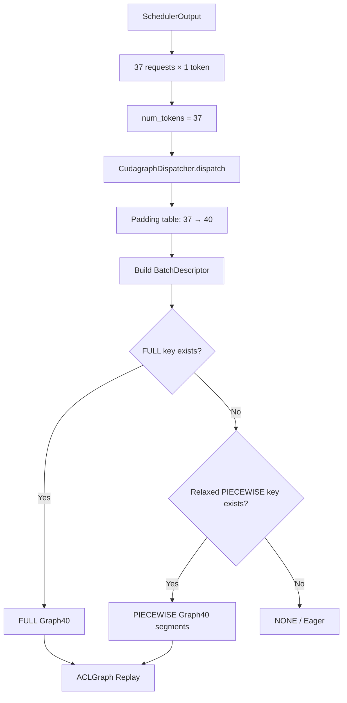

线上 Decode 有一个看起来很奇怪的现象：Scheduler 明明只调度了 37 个 Token，执行侧最后用的却是 Graph40。

这是 vLLM 的预期行为。它没有为每个可能的 Batch 都保存一张图，而是先准备一组 Capture Size。运行时的 Token 数落在两个 Size 之间，就向上补到最近的一档：

```text
num_tokens = 37
capture sizes = [..., 32, 40, 48, ...]

37 → 40
```

多出来的 3 个位置换来了一次静态 Graph Replay。这个选择解决了 Decode 阶段的 Host 提交开销，也带来了 Padding、Capture 时间、设备内存和 ACL Stream 等成本。

本文不展开整个 vLLM 编译系统，只追踪一条执行链：

```text
Scheduler
  → num_tokens
  → CudagraphDispatcher
  → BatchDescriptor
  → FULL / PIECEWISE / NONE
  → CUDAGraphWrapper / ACLGraphWrapper
  → Capture 或 Replay
```

分析基于以下上游提交：

```text
vLLM:        2c7d7dd64a2eaba0feedf42cab2f527486d7479c
vLLM-Ascend: e6a133f710c54e84cefcd29be46678c50008e8ea
```

这两个项目仍在快速变化。默认 Capture Size、Attention Backend 能力和可用 Graph Mode 都属于版本相关行为。

## 1. Graph 优化的不是矩阵乘法

一个 Transformer Layer 会执行 Norm、QKV Projection、RoPE、Attention、O Projection 和 MLP 等操作。Eager 模式下，Host 需要沿着 Framework、Runtime 和 Driver 逐个提交设备任务：

```text
Host
 ├─ launch Norm ──────────→ Device
 ├─ launch QKV ───────────→ Device
 ├─ launch RoPE ──────────→ Device
 ├─ launch Attention ─────→ Device
 ├─ launch OProj ─────────→ Device
 └─ launch MLP ───────────→ Device
```

所以一次 Forward 的时间不只包含设备计算：

```text
Forward latency
≈ device compute
+ framework / runtime
+ operator dispatch
+ kernel launch
+ synchronization
```

Prefill 一次处理的 Token 较多，大型 GEMM 和 Attention 往往占据主要时间。普通 Decode 中，每个 Request 每轮通常只处理一个新 Token，很多设备任务更短，Host 提交间隙更容易出现在时间线上。

Graph 把一组操作及其依赖保存下来，后续一次提交整张图：

```text
Eager: Host ─ op1 ─ op2 ─ op3 ─ op4 ─→ Device

Graph: Host ─────── graph replay ─────→ Device
```

同一个 GEMM 并不会因为进入 Graph 就改变计算公式。Graph 减少的是重复提交这组工作的 Host 开销。

这里还要把 Graph 和算子融合分开：

- Graph 减少一串设备任务的提交开销；
- `torch.compile` 和 Fusion Pass 可能减少这串任务本身的节点数、Kernel 数和中间 Tensor；
- 二者可以同时生效，但不能把融合收益算到 Graph 上，也不能用 Graph Replay 证明某个算子融合已经发生。

## 2. 下到 Runtime：Graph 不认识 Token

CUDA Graph 不理解 Request、Token 或 Continuous Batching。它记录的是 CUDA 操作节点、参数和依赖；ACLGraph 面向 Ascend 设备，解决的是同一类重复提交问题。

假设上层用 Size 2 捕获一次执行，底层看到的内容可以抽象成：

```text
Graph(size=2)

kernel A<<<grid_A_for_2, block_A>>>(
    input_ptr,
    output_ptr,
    ...
)

kernel B<<<grid_B_for_2, block_B>>>(
    output_ptr,
    workspace_ptr,
    ...
)
```

上层框架还会准备地址稳定的输入 Buffer、Position、Slot Mapping、Attention Metadata 和输出 Buffer。Replay 前更新的是这些 Buffer 的内容，而不是重新跑一遍 Python 调度并分配另一套地址。

因此，Size 2 的图描述的是 capacity=2 的一套执行环境：

```text
input buffer       [2, hidden]
position buffer    [2]
slot mapping       [2]
output buffer      [2, hidden]
```

实际范围变成 4 时，设备当然还能计算，但 Size 2 的 executable graph 不会自行推导新的 Tensor Shape、Grid、Workspace 和 Attention 参数。上层需要另一张容量足够的图，或者回到非 Graph 路径。

反过来，三个有效位置可以放进 Size 4：

```text
Graph(size=4)

slot 0: real
slot 1: real
slot 2: real
slot 3: padding
```

这就是 Bucket 的容量关系：

```text
actual <= captured capacity  → Padding 后可以 Replay
actual >  captured capacity  → 这张图放不下
```

CUDA API 提供 executable graph update，Kernel 也可以读取运行时有效长度。问题在于，LLM Forward 不只有一个带边界判断的 Kernel，还包含 GEMM、Attention、通信、Workspace 和多组 Metadata。用一张最大图覆盖全部 Shape，会把动态处理转移到 Kernel 内，并让小 Batch 承担大容量图的空转。vLLM 选择了多档 Bucket，而不是一张无限泛化的图。

## 3. vLLM 中的 Batch 有三个不同口径

很多讨论把 `batch_size` 当成一个量，到了 Prefill、Mixed Batch 或 Speculative Decoding 就会对不上。Graph 分派至少涉及三个口径。

### 3.1 `num_reqs`：当前有多少个 Request

```text
num_reqs = 37
```

`max_num_seqs` 主要限制这一维：一个 Scheduler Step 最多容纳多少条 Sequence。

### 3.2 `num_tokens`：本轮实际执行多少个 Token

普通 Decode 中，每个 Request 一般调度一个 Token：

```text
37 requests × 1 token

num_reqs   = 37
num_tokens = 37
```

Prefill 中两者很容易分开：

```text
Request A: 1000 tokens
Request B:  500 tokens
Request C:  300 tokens

num_reqs   = 3
num_tokens = 1800
```

Speculative Decoding 也会改变这个关系。每个 Request 一轮可能携带多个待验证 Token，`num_tokens` 不再等于 `num_reqs`。

### 3.3 Capture Size：Graph 覆盖的容量

如果候选 Size 是：

```text
[1, 2, 4, 8, 16, 24, 32, 40, 48]
```

`num_tokens=37` 会落到 40：

```text
37 real token slots
 3 padding slots
───────────────────
40 graph slots
```

用公式表示：

$$
G(T)=\min\{g \mid g \in S,\ g \ge T\}
$$

其中 $T$ 是真实 `num_tokens`，$S$ 是 Capture Size 集合，$G(T)$ 是 Padding 后的 Size。

但这只是容量映射，还不是完整的 Graph Key。

## 4. 完整的分派键是 `BatchDescriptor`

当前 vLLM 在 `vllm/forward_context.py` 中定义了 `BatchDescriptor`：

```python
@dataclass(frozen=True)
class BatchDescriptor:
    num_tokens: int
    num_reqs: int | None = None
    uniform: bool = False
    has_lora: bool = False
    num_active_loras: int = 0
```

这些字段回答了五个问题：

| 字段 | 运行时含义 |
|---|---|
| `num_tokens` | Padding 后的 Token 容量 |
| `num_reqs` | Padding 后对应的请求数；PIECEWISE 可以放宽为 `None` |
| `uniform` | 每个请求的 Query Length 是否一致 |
| `has_lora` | 当前 Batch 是否启用 LoRA |
| `num_active_loras` | 当前启用了多少个不同的 LoRA Adapter |

LoRA 数量会进入 Key，是因为某些 Kernel 的 Grid Size 依赖活跃 Adapter 数。只按 `num_tokens` 复用图，不能保证这类 Kernel 的执行形状仍然有效。

可以把 Dispatcher 的判断拆成两层：

```text
第一层：容量
num_tokens → padded num_tokens

第二层：兼容性
num_reqs / uniform / LoRA / allowed modes
→ 这张图能不能用
```

所以，“vLLM Graph 看的是 `num_tokens`”只说对了一半。`num_tokens` 是主要容量维度，`BatchDescriptor` 才是实际查找 Graph 的 Key。

## 5. 启动时，vLLM 先准备哪些图

Graph 不是等线上请求来了以后才临时决定一切。启动阶段会先生成 Capture Size、建立合法 Key，再按这些 Key 做 Warmup 和 Capture。

### 5.1 `_set_cudagraph_sizes()` 生成候选 Size

当前上游默认规则的主体是：

```python
[1, 2, 4]
+ range(8, 256, 8)
+ range(256, max_size + 1, 16)
```

最终列表还会受以下配置和运行条件影响：

- `max_num_seqs`；
- `max_num_batched_tokens`；
- 平台默认最大值；
- uniform decode 的 Query Length；
- Speculative Decoding；
- Sequence Parallelism；
- 用户显式提供的 `cudagraph_capture_sizes`。

在 `performance_mode="interactivity"` 下，小 Shape 会更密：1～32 范围内可以逐个 Size 覆盖。默认列表是实现细节，不宜把某一版的完整序列写死成长期经验。

### 5.2 `initialize_cudagraph_keys()` 建立合法 Key

Attention Backend 初始化、Graph Mode 确定以后，`CudagraphDispatcher` 才建立 Key 集合。Dispatcher 分别维护 FULL 和 PIECEWISE 两套集合：

```text
cudagraph_keys[FULL]
cudagraph_keys[PIECEWISE]
```

PIECEWISE 的 Key 会放宽为：

```python
replace(batch_desc, num_reqs=None, uniform=False)
```

它只要求被捕获的 Segment 能处理这档 Token 容量，不把完整 Attention Batch 形态写进 Key。FULL 则保留更精确的 `num_reqs` 和 `uniform`，因为 Attention 也在图内，元数据和后端调度可能依赖这些信息。

### 5.3 `capture_model()` 先 Warmup，再 Capture

`GPUModelRunner.capture_model()` 从 Dispatcher 取得 Capture Descriptor，并按 Size 从大到小处理。大 Shape 先捕获，较小 Shape 可以复用已经建立的 Graph Memory Pool。

每个 Descriptor 会经过：

```text
_warmup_and_capture(desc)
  │
  ├─ _dummy_run(mode=NONE)
  │    Eager Warmup
  │    FULL 时强制执行 Attention Warmup
  │
  ├─ device synchronize
  │
  └─ _dummy_run(mode=FULL / PIECEWISE)
       触发 Wrapper Capture
```

Warmup 使用 `NONE`，让算子、Workspace 和 Attention Backend 先完成初始化，避免把首次初始化动作带进 Graph Capture。FULL 的 Attention 也必须参与 Warmup，否则第一次进入 Graph 时仍可能触发初始化或动态分配。

这段流程也解释了启动时间为什么会随 Capture Coverage 增加：多一个 Descriptor，不只是多一个列表元素，还会增加 Dummy Run 和对应 Wrapper 的 Capture 工作。

## 6. 运行时手推：37 个 Decode Request 如何落到 Graph40

下面限定一个简单场景：

```text
普通 Decode，无 Speculative Decoding
未启用 Sequence Parallelism 或 DP 二次 Padding
未触发 Cascade Attention，也没有 Encoder Output
num_reqs = 37
每个 Request 的 query_len = 1
num_tokens = 37
uniform_decode = True
has_lora = False
capture sizes 包含 32、40、48
max_num_seqs >= 40
FULL Graph Key 已完成 Capture
```

### 第一步：Runner 计算本轮 Token 数

Scheduler 输出每个 Request 本轮调度的 Token 数，Runner 汇总得到：

```text
num_tokens_unpadded = 37
```

随后进入 `_determine_batch_execution_and_padding()`，并调用：

```python
self.cudagraph_dispatcher.dispatch(
    num_tokens=37,
    uniform_decode=True,
    has_lora=False,
    num_active_loras=0,
)
```

### 第二步：查预计算的 Padding 表

`_compute_bs_to_padded_graph_size()` 在初始化时已经把整数范围映射到下一档 Capture Size：

```text
32 → 32
33 → 40
34 → 40
...
39 → 40
40 → 40
```

因此：

```text
num_tokens_padded = 40
```

### 第三步：构造 `BatchDescriptor`

普通 Decode 的 uniform query length 为 1。FULL 模式下：

```text
num_reqs = min(40 / 1, max_num_seqs) = 40
uniform = True
```

最终 Key 为：

```python
BatchDescriptor(
    num_tokens=40,
    num_reqs=40,
    uniform=True,
    has_lora=False,
    num_active_loras=0,
)
```

注意这里的 `num_reqs=40` 描述的是 Padding 后的图执行形态，不是说线上突然多出了三个真实请求。

### 第四步：先查 FULL，再查 PIECEWISE

`dispatch()` 的优先级是：

```text
FULL → PIECEWISE → NONE
```

如果上面的精确 Key 存在于 `cudagraph_keys[FULL]`，Dispatcher 返回 FULL。否则，它把 Key 放宽为：

```python
BatchDescriptor(
    num_tokens=40,
    num_reqs=None,
    uniform=False,
    has_lora=False,
    num_active_loras=0,
)
```

再查询 PIECEWISE。两套 Key 都不匹配，或者 37 超过最大 Capture Size，最终返回 `NONE`。

### 第五步：Wrapper Replay

Dispatcher 把 Mode 和 `BatchDescriptor` 放入 Forward Context。Wrapper 不会重新做分派，只检查两件事：

```text
运行时 Mode 是否等于自己的 Mode
这个 BatchDescriptor 是否已有 Graph Entry
```

命中以后：

```python
entry.cudagraph.replay()   # CUDA
entry.aclgraph.replay()    # Ascend
```

完整路径可以画成：



## 7. FULL 与 PIECEWISE 的区别不只是图的大小

vLLM 定义了 `NONE`、`PIECEWISE`、`FULL`、`FULL_DECODE_ONLY` 和 `FULL_AND_PIECEWISE`。组合模式会根据 Batch 类型选择不同的运行时 Mode。

| 配置 | Decode 路径 | Prefill / Mixed 路径 | 主要条件与成本 |
|---|---|---|---|
| `NONE` | Eager | Eager | 便于调试，不承担 Graph Capture 成本 |
| `PIECEWISE` | 分段 Graph | 分段 Graph | Attention 等分割点可留在图外；Graph Entry 数更多 |
| `FULL` | Full Graph | 后端允许时使用 Full Graph | 对 Attention Backend 和 Batch Key 要求更高 |
| `FULL_DECODE_ONLY` | uniform decode 用 FULL | 非 decode 走 NONE | 适合以 Decode 为主的实例 |
| `FULL_AND_PIECEWISE` | 优先 FULL | 尝试 PIECEWISE | 覆盖面更广，Capture Coverage 也更大 |

PIECEWISE 依赖 vLLM 的分段编译或可打断 Graph 机制。典型结构是：

```text
Captured Segment A
        ↓
Dynamic / Eager Attention
        ↓
Captured Segment B
        ↓
Captured Segment C
```

FULL 和 PIECEWISE 可以通过嵌套 Wrapper 共存：

```text
CUDAGraphWrapper(FULL)
└─ compiled model
   ├─ CUDAGraphWrapper(PIECEWISE, segment 0)
   ├─ dynamic op / attention boundary
   └─ CUDAGraphWrapper(PIECEWISE, segment 1)
```

运行时选中 FULL 时，外层 Wrapper Capture/Replay，内层 Mode 不匹配，直接执行其底层 Runnable；选中 PIECEWISE 时，外层透传，内层对应 Segment 的 Wrapper 工作。`NONE` 则两层都透传。

这套设计把“选择哪种图”和“怎么 Capture/Replay”分开了：Dispatcher 是合法 Key 的唯一来源，Wrapper 信任 Forward Context 中的结果。

## 8. Ascend 不是把 `cuda` 字符串替换成 `npu`

vLLM-Ascend 复用上游的 `CudagraphDispatcher` 和 `BatchDescriptor`，设备侧 Wrapper 则换成 `ACLGraphWrapper`。它使用：

```python
aclgraph = torch.npu.NPUGraph()

with torch.npu.graph(aclgraph, pool=self.graph_pool):
    output = self.runnable(*args, **kwargs)

aclgraph.replay()
```

接口形态与 CUDA 相近，但 Full Graph 中的 Attention 参数更新需要单独处理。当前 `acl_graph.py` 维护了按 Capture Size 索引的 `GraphParams`：

```python
@dataclass
class GraphParams:
    events: dict[int, list[torch.npu.ExternalEvent]]
    workspaces: dict[int, torch.Tensor]
    handles: dict[int, list[...]]
    attn_params: dict[int, list[tuple]]
```

`update_full_graph_params()` 在 Replay 前调用 Attention Backend 的 `update_graph_params()`，更新本轮 Attention 需要的状态。FULL Replay 还要保证参数更新与前一轮图执行的顺序；当前 Wrapper 在相应路径上会先同步 NPU Stream，再执行 `aclgraph.replay()`。

这说明“Graph Shape 静态”不等于“所有运行时内容都不变”。图的执行拓扑和 Buffer 地址保持可复用，Sequence Length、Block Table、Slot Mapping、Workspace 句柄等动态信息仍需要通过预分配 Buffer 或 Backend 更新机制送入本轮执行。

## 9. Capture Size 增多后，资源花在哪里

模型权重通常由不同 Graph 共享。捕获 100 张图，不会把一份 40 GB 权重简单复制 100 次。新增成本主要来自 Graph Entry 以及它依赖的执行环境。

### 9.1 Capture Size 数量与最大 Size 是两个维度

比较两组配置：

```text
A = [8, 16, 32, 64]
B = [1, 2, 3, ..., 64]
```

两者最大 Size 都是 64，B 的 Graph Key 更多。它更容易增加：

- Warmup 和 Capture 次数；
- executable graph / ACLGraph Entry；
- Host 侧 Descriptor 和 Metadata；
- PIECEWISE Segment 对应的 Graph 实例；
- LoRA 专门化带来的 Key 组合；
- ACL Stream 和运行时依赖资源。

再看：

```text
C = [8, 16, 32, 64, 128, 256, 512]
```

C 的列表不密，但最大 Shape 更大，往往需要更大的输入 Buffer、Attention Workspace 和 Graph Memory Pool。

因此，两类配置问题要分开看：

| 调整项 | 更直接的影响 |
|---|---|
| 增加 Capture Size 数量 | Graph Key、Capture 次数、Segment Entry、Metadata 与 Stream 压力 |
| 增大最大 Capture Size | 最大 Tensor 容量、Workspace、单次 Replay 工作量和 Padding 上界 |

### 9.2 PIECEWISE 为什么更敏感

一个 FULL Key 通常对应一张更完整的 Forward Graph。PIECEWISE 下，同一个 Key 会命中多个 Wrapper，每个可捕获 Segment 都可能维护自己的 Entry。

不能把图数量机械写成“Capture Size 数 × 模型层数”，因为分段数取决于编译结果、模型结构和 Backend。但源码已经给出了资源增长方向：PIECEWISE 捕获阶段会在多段 Graph 之间反复进入 Wrapper，甚至专门关闭后续 Segment 的 GC 和 `empty_cache`，避免逐段清理拖慢 Capture。

### 9.3 Ascend 可能先遇到 Stream 资源不足

当前 vLLM-Ascend 的 `ACLGraphWrapper` 会识别以下错误特征：

```text
207008
stream resources are insufficient
insufficient_stream_resources
```

捕获失败时，源码给出的处理方向包括：

- 减少 `cudagraph_capture_sizes`；
- 降低 `max_cudagraph_capture_size`；
- 以 uniform decode 为主时优先考虑 `FULL` 或 `FULL_DECODE_ONLY`；
- 暂时关闭 Graph，确认错误是否确实由 Capture 引起；
- 老版本出现 `Alloc sq cq fail` 时，检查 HDK/CANN 版本匹配。

这类问题不能只看 `npu-smi`。HBM 还有剩余，不代表 ACL Runtime 仍能为更多 Graph 分配 Stream 和执行依赖资源。

### 9.4 TP、EP、MoE 会把问题放大，但没有固定倍数

并行模型的图中还可能包含 AllReduce、ReduceScatter 或 AllToAll。集合通信会带入通信 Stream、事件、Workspace 和依赖关系。

```text
PIECEWISE / FULL_AND_PIECEWISE
+ 大模型或深层模型
+ TP / EP
+ MoE
+ 密集 Capture Sizes
```

这组组合需要更保守地扩展 Bucket。先到上限的可能是 Stream，也可能是 HBM、Workspace 或启动时间，取决于模型、并行策略、Attention Backend 和 CANN/HDK 版本，不能给出跨环境通用的资源排序。

## 10. Padding 为什么会形成性能台阶

假设 Bucket 是：

```text
8, 16, 24, 32, 40
```

从 16 增长到 17 时，执行容量从 Graph16 跳到 Graph24：

```text
16 → Graph16
17 → Graph24
```

以 Slot 计算，17 落到 24 的 Padding Ratio 为：

$$
\frac{24-17}{24}\approx29.2\%
$$

23 落到 24 时则是：

$$
\frac{24-23}{24}\approx4.2\%
$$

这个比例不能直接等同于端到端算力浪费。不同 Kernel 对 Padding 的处理不同，Attention、GEMM 和通信的成本也不随 Token 数严格线性增长。但它足以说明为什么压测不能只选整齐的 Batch。

每个候选 Size 至少测试三个点：

```text
G - 1
G
G + 1
```

例如：

```text
15 / 16 / 17
23 / 24 / 25
31 / 32 / 33
39 / 40 / 41
```

时间线中要同时检查两件事：Replay 消除了多少 Host Launch Gap，跨 Bucket 后又增加了多少设备工作。

## 11. Capture Size 应该由线上分布决定

将 1～256 全部 Capture，确实可以消除这一范围内的容量 Padding：

```text
37 → Graph37
```

但每个 Runtime Mode、LoRA Case 和 PIECEWISE Segment 都可能增加 Entry。为了低频 Batch 少算几个 Padding Slot，长期保存大量图，通常不是划算的交换。

更实用的做法是统计每个 Scheduler Step 的执行特征：

- 原始 `num_tokens`；
- Padding 后的 `num_tokens`；
- `num_reqs`；
- `uniform`；
- FULL、PIECEWISE 或 NONE；
- LoRA 状态；
- Eager Fallback 次数。

当前 vLLM 已有 CUDAGraph Metrics，统计项包括 Unpadded Tokens、Padded Tokens、Padding 数、Runtime Mode 和出现次数。先拿到这张表，再决定加哪一个 Bucket。

假设业务的大量 Step 落在 33～40，而现有配置只有 32 和 64：

```text
33～40 → Graph64
```

第一步可以只增加 40：

```text
[1, 2, 4, 8, 16, 24, 32, 40, 48, 64]
```

如果数据继续显示 35～38 是稳定热点，再分别测试 36 或 38。没有必要一次补齐 33～39。

## 12. 一套可以落地的调优顺序

### 12.1 先记录默认配置

保留以下信息：

```text
vLLM / vLLM-Ascend commit
CANN / HDK 版本
模型与量化方式
TP / DP / EP 配置
Attention Backend
Graph Mode
cudagraph_capture_sizes
max_cudagraph_capture_size
```

不固定版本，Graph Mode 和默认 Size 的变化会让两轮结果无法比较。

### 12.2 再记录启动成本

至少观察：

- Graph Capture 总时间；
- Capture 前后的设备空闲内存变化；
- 实际捕获的 FULL / PIECEWISE Descriptor 数量；
- ACLGraph Stream 或 Workspace 报错。

当前 vLLM 的 `capture_model()` 本身会记录 Capture 用时和设备内存变化；新版本还提供 Graph Memory Profile。不要使用“每张图固定占多少 MB”这样的经验值替代实测。

### 12.3 分开压 Prefill、Decode 和 Mixed Batch

三类 Batch 的 `BatchDescriptor` 不同，Graph 命中条件也不同。混在一个吞吐数字里，很难判断收益来自 Decode Replay，还是来自请求组成变化。

### 12.4 每轮只增加少量热点 Size

对候选 Size 做边界压测，并同时记录：

```text
TTFT
TPOT / inter-token latency
吞吐
Graph hit / fallback
Padding slots
Capture 时间
HBM / Workspace
ACL Stream 错误
```

只有端到端指标和资源指标同时可接受，这个 Bucket 才值得留下。

## 13. 结语：37 → 40 是一次容量与兼容性选择

Graph Runtime 不会数 Token。Scheduler 决定本轮工作量，Model Runner 把请求整理成 Tensor 和 Metadata，Dispatcher 再把动态 Batch 映射成一个已经准备好的静态执行 Key：

```text
37 个普通 Decode Request
        ↓
num_tokens = 37
        ↓
Padding Size = 40
        ↓
BatchDescriptor(40, 40, uniform=True, ...)
        ↓
FULL 优先，PIECEWISE 次之，最后 NONE
        ↓
CUDA Graph / ACLGraph Replay
```

Capture Size 变密，可以减少 Padding；相应地，Warmup、Graph Entry、Segment、Metadata 和 Stream 资源都会增加。最大 Capture Size 变大，又会抬高 Buffer 与 Workspace 上界。

Capture Size 的配置目标很具体：用尽量少的 Graph Key 覆盖线上最常见的 BatchDescriptor。热点 Shape 精确 Capture，低频 Shape Padding，超出范围或不兼容的 Batch 回到 NONE。

## 参考资料

1. [NVIDIA CUDA Programming Guide — CUDA Graphs](https://docs.nvidia.com/cuda/cuda-programming-guide/04-special-topics/cuda-graphs.html)
2. [vLLM CUDA Graphs Design](https://docs.vllm.ai/en/stable/design/cuda_graphs/)
3. [vLLM `BatchDescriptor`（固定提交）](https://github.com/vllm-project/vllm/blob/2c7d7dd64a2eaba0feedf42cab2f527486d7479c/vllm/forward_context.py)
4. [vLLM `CudagraphDispatcher`（固定提交）](https://github.com/vllm-project/vllm/blob/2c7d7dd64a2eaba0feedf42cab2f527486d7479c/vllm/v1/cudagraph_dispatcher.py)
5. [vLLM `CUDAGraphWrapper`（固定提交）](https://github.com/vllm-project/vllm/blob/2c7d7dd64a2eaba0feedf42cab2f527486d7479c/vllm/compilation/cuda_graph.py)
6. [vLLM `_set_cudagraph_sizes()`（固定提交）](https://github.com/vllm-project/vllm/blob/2c7d7dd64a2eaba0feedf42cab2f527486d7479c/vllm/config/vllm.py)
7. [vLLM `GPUModelRunner` Capture 流程（固定提交）](https://github.com/vllm-project/vllm/blob/2c7d7dd64a2eaba0feedf42cab2f527486d7479c/vllm/v1/worker/gpu_model_runner.py)
8. [vLLM-Ascend Graph Mode Guide](https://docs.vllm.ai/projects/ascend/en/main/user_guide/feature_guide/graph_mode.html)
9. [vLLM-Ascend `ACLGraphWrapper`（固定提交）](https://github.com/vllm-project/vllm-ascend/blob/e6a133f710c54e84cefcd29be46678c50008e8ea/vllm_ascend/compilation/acl_graph.py)
